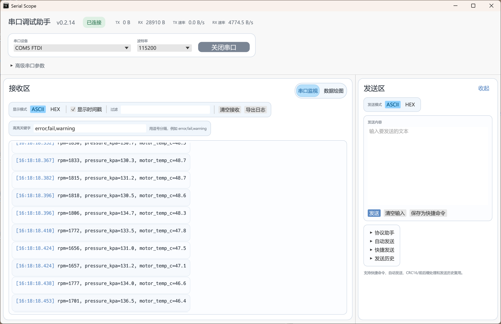
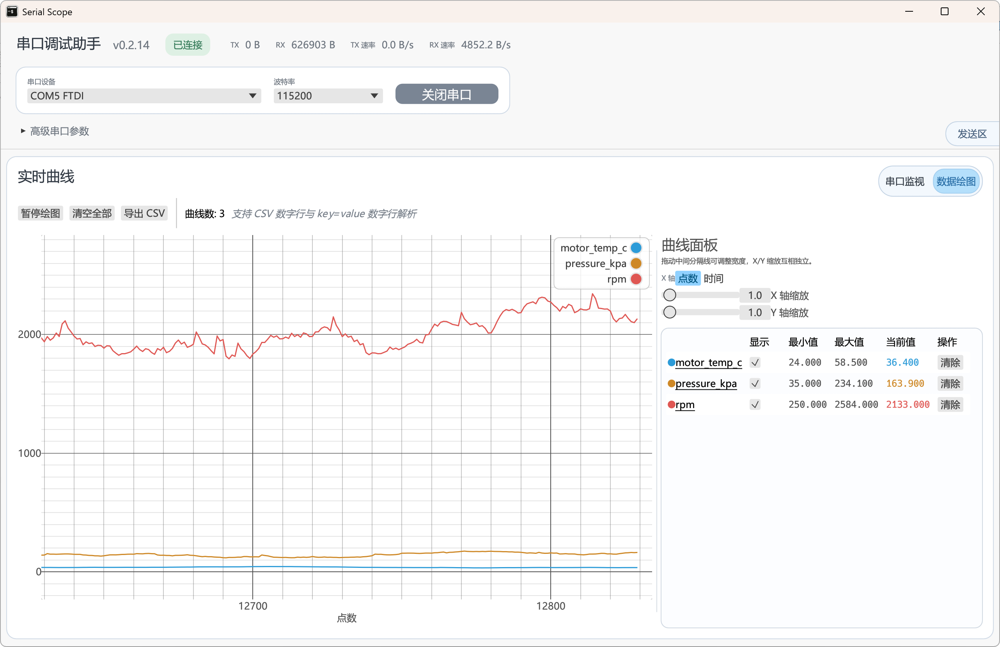

# Serial Scope

一个使用 `Rust + egui` 开发的**串口调试助手**，免费，高性能，跨平台，操作简单，UI 清爽，支持串口数据**绘图**。

[下载](https://github.com/Nitmi/serial-scope/releases/latest)

## 界面预览

<p>
  
</p>

<p>
  
</p>

## 核心能力

- **稳定的接收监视**：按完整文本行展示接收数据，支持时间戳、过滤、高亮关键字、自动跟随和大日志虚拟渲染。
- **协议发送效率**：支持 ASCII/HEX 发送、快捷命令、发送历史、自动发送、前后缀 HEX、追加 CRLF、追加 CRC16(Modbus)。
- **实时数据绘图**：自动解析 CSV 数字行和 `key=value` 数字行，实时生成多曲线图。
- **曲线控制**：曲线显示/隐藏、清空、重命名、缩放、暂停绘图、导出 CSV。
- **日志导出**：接收日志可导出为文本文件，曲线数据可导出为 CSV。

## 支持的数据格式

Serial Scope 的绘图解析器面向“调试时最常见的文本输出”，会忽略混杂的普通调试文本，只消费稳定的数字行。

### CSV 数字行

```text
1.23,4.56,7.89
```

默认会映射为 `ch1`、`ch2`、`ch3`，也可以在配置中指定通道名。

### Key=Value 数字行

```text
rpm=2058, pressure_kpa=125.2, motor_temp_c=38.0
```

曲线名会直接使用 key，例如 `rpm`、`pressure_kpa`、`motor_temp_c`。

## 技术栈

- Rust 2021
- `eframe` / `egui` / `egui_plot`
- `serialport`
- `crossbeam-channel`
- `serde` / `toml`
- `anyhow`
- `chrono`
- `fontdb`

## 本地运行

### 安装 Rust stable

```bash
rustup default stable
```

### Windows 依赖

使用 MSVC 工具链，并安装以下任意一种：

- Visual Studio 2022 Build Tools
- 带 C++ 构建工具的 Visual Studio Community

如果缺少 `link.exe`，`cargo run` 和 `cargo build` 会失败。

### Fedora Linux 依赖

```bash
sudo dnf install gcc gcc-c++ systemd-devel fontconfig-devel freetype-devel libX11-devel libXcursor-devel libXi-devel libXrandr-devel libXinerama-devel libxcb-devel mesa-libGL-devel wayland-devel libxkbcommon-devel
```

### 启动开发版本

```bash
cargo run
```

### 构建发布版本

```bash
cargo build --release
```

生成产物：

- Windows：`target/release/serial-scope.exe`
- Linux：`target/release/serial-scope`

## License

本项目使用 MIT License。
