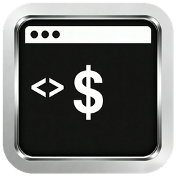

# serial-scope

Current version: `0.2.4`

`serial-scope` is a cross-platform Rust serial debugging tool built with `eframe + egui`, targeting Windows and Fedora Linux. It supports asynchronous serial communication, ASCII/HEX send and display modes, text line parsing, real-time plotting, quick commands, auto-send, protocol helpers, and local TOML-based configuration.

## Features

- Serial port enumeration
- Serial configuration: baud rate / data bits / stop bits / parity
- Open / close port
- Background serial worker thread with non-blocking GUI
- ASCII / HEX send modes
- ASCII / HEX receive display modes
- Receive records grouped by complete text line
- Receive filtering, keyword highlighting, timestamp toggle
- Quick commands and send history reuse
- Auto-send with interval and repeat limit
- Protocol helper: HEX prefix / suffix, append CRLF, append CRC16 (Modbus)
- Text line parsing
  - `1.23,4.56,7.89`
  - `temp=23.5,hum=60.2`
- Configurable parser MVP: Auto / CSV / Key=Value, CSV delimiter, channel names
- Real-time plotting with per-series show/hide and clear
- Plot CSV export
- Receive log export
- Config persistence via `config.toml`

## Tech Stack

- Rust stable
- `eframe`, `egui`, `egui_plot`
- `serialport`
- `crossbeam-channel`
- `serde`, `toml`
- `anyhow`
- `hex`
- `chrono`
- `fontdb`

## Preview



## Project Layout

```text
serial-scope/
├─ Cargo.toml
├─ LICENSE
├─ README.md
├─ examples/
│  └─ serial_plot_template.c
└─ src/
   ├─ main.rs
   ├─ app.rs
   ├─ config.rs
   ├─ serial/
   │  ├─ mod.rs
   │  ├─ manager.rs
   │  ├─ protocol.rs
   │  └─ types.rs
   ├─ parser/
   │  ├─ mod.rs
   │  └─ line_parser.rs
   └─ ui/
      ├─ mod.rs
      ├─ top_bar.rs
      ├─ receive_panel.rs
      ├─ send_panel.rs
      └─ plot_panel.rs
```

## Run

### 1. Install Rust stable

```bash
rustup default stable
```

### 2. Windows dependencies

Use the MSVC toolchain and install one of the following:

- Visual Studio 2022 Build Tools
- Visual Studio Community with C++ build tools

If `link.exe` is missing, `cargo run` and `cargo build` will fail.

### 3. Fedora Linux dependencies

```bash
sudo dnf install gcc gcc-c++ systemd-devel fontconfig-devel freetype-devel libX11-devel libXcursor-devel libXi-devel libXrandr-devel libXinerama-devel libxcb-devel mesa-libGL-devel wayland-devel libxkbcommon-devel
```

### 4. Start in development mode

```bash
cargo run
```

## Build Release

```bash
cargo build --release
```

Generated binaries:

- Windows: `target/release/serial-scope.exe`
- Linux: `target/release/serial-scope`

## Packaging

- Windows builds still embed `assets/app-icon.ico` into `serial-scope.exe` through `build.rs`
- Release archives are intentionally minimal portable bundles:
  - Windows release asset is the raw `serial-scope-windows-x86_64-portable.exe` binary
  - Windows also ships an installer asset: `serial-scope-windows-x86_64-setup.exe`
  - Linux tar.gz contains only `serial-scope`
  - macOS zip contains only `Serial Scope.app`
- Local packaging helpers:
  - Windows: `packaging\windows\package-windows.bat`
  - Linux: `bash packaging/linux/package-linux.sh`
  - macOS: `bash packaging/macos/package-macos.sh`

For beginner-friendly Windows usage, prefer the installer build:

- default install path: `%LocalAppData%\Programs\Serial Scope`
- creates a desktop shortcut
- keeps the portable `.exe` release available for users who prefer no-install mode

Windows SmartScreen warnings cannot be fully eliminated by packaging changes alone. The practical fix is code signing. This repository now supports optional signing in GitHub Actions when these secrets are configured:

- `WINDOWS_SIGN_CERT_B64`
- `WINDOWS_SIGN_CERT_PASSWORD`

## GitHub Actions Release

This repository includes:

- `.github/workflows/ci.yml`
  - runs on pushes to `main` and `feature/**`
  - runs on every pull request
  - checks:
    - `cargo fmt --check`
    - `cargo test --locked`
    - `cargo clippy --all-targets --all-features --locked`
- `.github/workflows/release.yml`
  - runs on `v*` tags and `workflow_dispatch`
  - validates formatting, tests, and clippy before release packaging
  - creates the GitHub Release once after all platform artifacts are ready, so the changelog body is applied consistently

On Linux CI, `libudev-dev` is installed because the `serialport` dependency uses `libudev` on Linux.
The workflow also sets `FORCE_JAVASCRIPT_ACTIONS_TO_NODE24=true` to opt into the newer GitHub Actions JavaScript runtime and avoid the Node.js 20 deprecation warning.

- Manual test build: run the `release` workflow from the Actions tab using `workflow_dispatch`
- Tagged release build: push a tag like `v0.2.4`
- Build targets: `windows-latest`, `ubuntu-latest`, and `macos-latest`
- Outputs:
  - workflow artifacts for each platform
  - GitHub Release assets automatically uploaded when the workflow is triggered by a tag
  - `latest.json` manifest for in-app update checks

Example:

```bash
git tag v0.2.4
git push origin v0.2.4
```

## Changelog

Release notes are sourced from `CHANGELOG.md`.

Before creating a release tag:

1. Add a new section in `CHANGELOG.md`
2. Use the exact version format without the `v` prefix, for example:

```md
## [0.2.4] - 2026-04-20

### Changed
- Windows portable release asset is now named `serial-scope-windows-x86_64-portable.exe` to distinguish it clearly from the installer package.

## [0.2.3] - 2026-04-20

### Added
- ...

### Changed
- ...

### Fixed
- ...
```

3. Commit the changelog update
4. Create and push the matching tag:

```bash
git tag v0.2.4
git push origin v0.2.4
```

If the matching changelog section is missing, the release workflow will fail instead of publishing incomplete notes.

For the full step-by-step release template, see [docs/release-checklist.md](docs/release-checklist.md).

## Configuration

The app reads and writes `config.toml` beside the running executable. In portable usage this means the extracted app folder; in the Windows installer build this means the installed app directory under `%LocalAppData%\Programs\Serial Scope`.

It persists:

- Selected serial port
- Baud rate
- Data bits / stop bits / parity
- Receive display mode
- Send mode
- Quick commands
- Auto-send settings
- Protocol helper settings
- Parser settings
- Receive filter and highlight keywords

## Parsing Notes

Parsing lives in `src/parser/line_parser.rs` and processes complete lines split by `\n`.

- CSV numeric lines map to configured channel names or fallback names like `ch1`, `ch2`, `ch3`
- `key=value` lines use the key names directly as plot series
- In `Auto` mode, CSV parsing only applies when the configured delimiter is actually present
- Invalid lines are ignored safely without crashing the app

## Export

- Receive logs export to `*_receive.txt`
- Plot data exports to `*_plot.csv`
- Export file prefix can be edited in the top toolbar

## License

This project uses the MIT License. It is a good fit here because it keeps the tool easy to reuse, modify, and redistribute for personal, educational, and commercial scenarios with minimal friction.

## Vibe Coding Note

This project is a vibe coding product: the codebase was generated and iteratively refined with the help of a large language model, then compiled, debugged, and adjusted through real usage feedback.

## Roadmap Ideas

- Multi-port sessions
- More protocol templates and checksum helpers
- Binary protocol parsers
- Advanced plot cursors and annotations
- Rolling file logging
